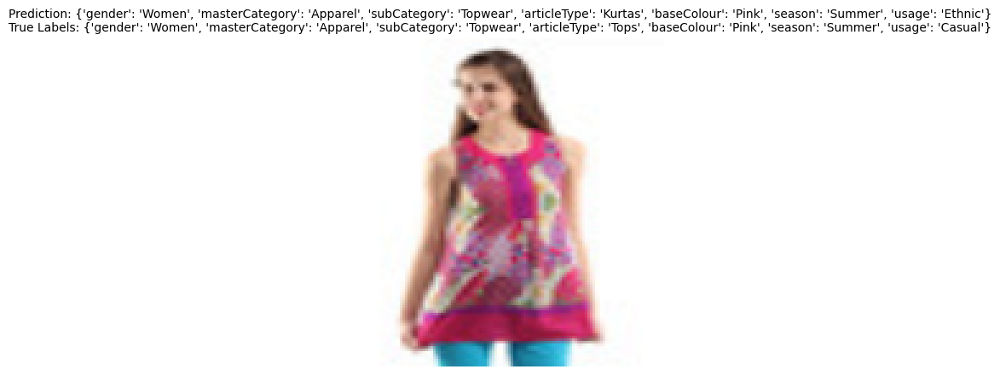
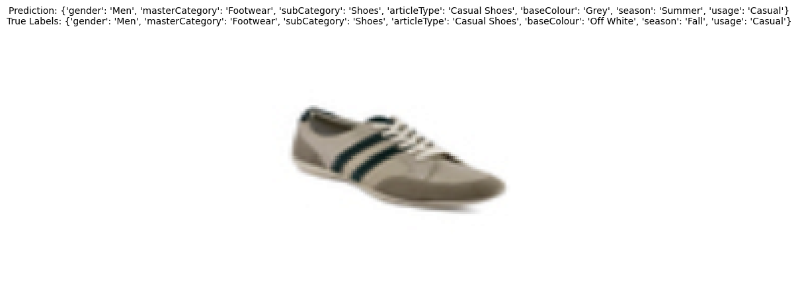
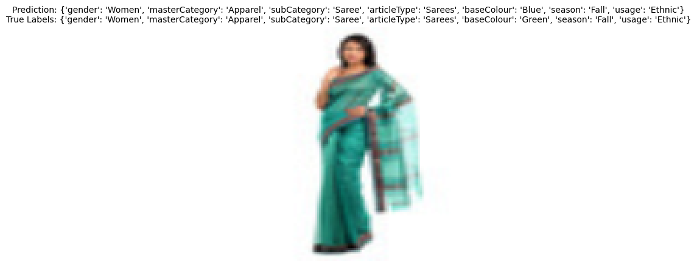
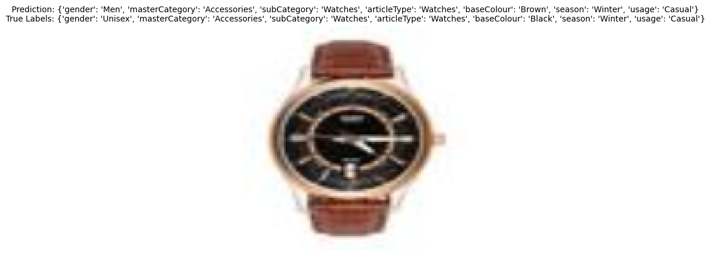

# 상품 카테고리 분류

상품의 타이틀(`product` 컬럼)과 이미지 특징(`img_feat` 컬럼)을 입력으로 활용하여 세부 카테고리를 예측합니다. 

텍스트 인코더로는 BERT와 LSTM 두 가지 옵션을 제공하며, 이는 각각 다음과 같은 근거로 설계되었습니다:

1. LSTM (기본값):

   - 효율성: 상대적으로 작은 모델로, 학습 및 추론이 빠르며, 제한된 하드웨어에서도 실행 가능합니다.
   - 데이터 특성: 학습 데이터는 비교적 간단한 상품명으로 구성되어 있으며, 문맥 이해가 복잡하지 않아 LSTM의 단순한 구조로도 충분히 학습이 가능합니다.
   - 모델 경량화: 데이터가 오래된 상품 정보를 포함하고 있어, 최신 사전 학습 모델(BERT 등)을 사용하는 것보다 효율적인 학습이 가능합니다.

2. BERT (옵션):

   - 강력한 표현력: 사전 학습된 BERT는 복잡한 문맥 이해가 필요한 데이터에서 우수한 성능을 발휘합니다.
   - 확장 가능성: 특정 상품명에서 의미나 문맥이 중요한 경우, BERT를 선택하여 더 높은 성능을 기대할 수 있습니다.

이미지 인코더로는 ResNet18을 사용하여 이미지를 효율적으로 처리합니다. 이는 다음과 같은 이유로 선택되었습니다:

- 표준적인 성능: ResNet18은 이미지 분류에서 널리 사용되는 모델로, 학습 안정성과 성능이 입증되었습니다.
- 데이터 적합성: 상품 이미지는 일반적으로 객체 탐지가 아닌 기본적인 특징 추출이 요구되므로, ResNet18의 특징 추출 능력으로 충분합니다.
- 경량 모델: ResNet18은 고성능과 효율적인 리소스 사용의 균형을 제공합니다.

### 모델 설계

텍스트와 이미지의 특징 벡터를 결합한 후, 각 타겟 변수에 대해 독립적인 분류기를 적용하여 다중 클래스 분류 문제를 해결합니다. 이 구조는 각 레이블에 대해 독립적으로 최적화할 수 있어 높은 유연성을 제공하며, 텍스트와 이미지 간 상호작용을 효과적으로 학습할 수 있도록 설계되었습니다.

---

## Requirements

- Python 3.10
- PyTorch 2.3

macOS 환경에서 실행을 확인하였으며, CPU 및 GPU 환경 모두에서 동작이 가능합니다.

---

## 데이터

1. 데이터를 다운로드하려면 아래 코드를 실행합니다.

```python
import kagglehub

# Download latest version
path = kagglehub.dataset_download("paramaggarwal/fashion-product-images-small")

print("Path to dataset files:", path)
```

2. 데이터는 이미지와 함께 텍스트 정보를 포함하며, 상품의 다양한 특징(예: 색상, 카테고리)을 포함합니다. 데이터는 학습과 테스트로 분리하여 사용합니다.

---

## 결과

### 1. 정량 평가

- Accuracy: 0.8682
- F1 Score: 0.5807
- Precision: 0.6171
- Recall: 0.5684

지표는 매크로 방식으로 계산되어 각 클래스에 동일한 가중치를 부여한 결과입니다. 이는 특정 클래스에 성능이 편중되지 않았다는 점에서 균형 있는 평가로 볼 수 있습니다. 모델은 약 86.82%의 정확도로 모든 클래스를 예측하고 있으며, 이는 대체로 안정적인 성능을 나타냅니다.

그러나 F1 Score가 Accuracy(0.8682)에 비해 현저히 낮습니다. 다중 클래스 분류 문제에서 클래스 간 불균형이 크거나 일부 클래스의 데이터가 제한적일 경우, 평균 F1 Score 0.5807도 수용 가능한 성능일 수 있습니다. 특히 문제의 난이도가 높은 경우, 이 정도의 F1 Score는 현실적인 결과로 해석될 가능성도 있습니다.

한편, 이는 모델이 일부 클래스에서 성능이 저조하거나 Precision과 Recall의 균형을 맞추는 데 어려움을 겪고 있음을 나타냅니다. 특히 다중 클래스 분류 문제에서 평균 F1 Score가 0.6 이하라면, 모델 성능 개선의 필요성을 시사하는 신호일 수 있습니다. 이를 보완하기 위해 정량적 결과에 더해 몇 가지 샘플을 선정하여 간단한 정성적 평가를 진행해보겠습니다.

### 2. 정성 평가

다음은 모델이 예측한 카테고리와 실제 라벨을 비교한 예시입니다:

#### 예시 1


#### 예시 2


#### 예시 3


#### 예시 4


#### 예시 5


모델은 대부분의 카테고리를 정확히 예측하였으나, 일부 예측에서 오차가 발생하였습니다. 예를 들어, '사용 용도(usage)'와 '기본 색상(baseColour)'은 텍스트와 이미지 모두에서 분류가 까다로운 요소로 나타났습니다. 이를 개선하기 위해 추가적인 데이터 증강 또는 더 깊은 모델을 활용할 수 있습니다. 

의견: 평가 결과를 볼 때, 모델은 기대에 부합하는 성능을 보여주고 있습니다. 주어진 데이터는 짧고 단순한 텍스트 데이터 구조에 최적화되어 있으며, 이를 효과적으로 처리하기 위해 해당 데이터에 적합한 모델을 선택합니다. 또한, 모델은 크기와 연산량 측면에서 상대적으로 경량화되어 있어 제한된 하드웨어 환경에서도 성능과 효율성 간의 균형을 잘 유지하고 있습니다. 그러나 실제 응용 분야에서는 각 텍스트가 특정 스타일이나 특징을 간결하게 설명하지 않거나, 데이터의 표현 방식이 다양하거나 복잡한 맥락을 포함할 가능성이 있습니다. 이러한 특성에 맞는 모델을 선택하거나 보완하는 것이 실질적인 적용에서 중요한 과제가 될 수 있습니다.  

---

## 결과 재현

```bash
#!/bin/bash

# 1. 데이터 전처리
python preprocess.py --output_dir data/

# 2. 모델 학습
python train.py --data_dir data/ --checkpoint_file checkpoints/model_checkpoint.pth --num_epochs 3 --batch_size 32 --learning_rate 1e-4

# 3. 평가 및 시각화
python evaluation.py --data_dir data/ --checkpoint_path checkpoints/model_checkpoint.pth --num_samples 5
```

---
